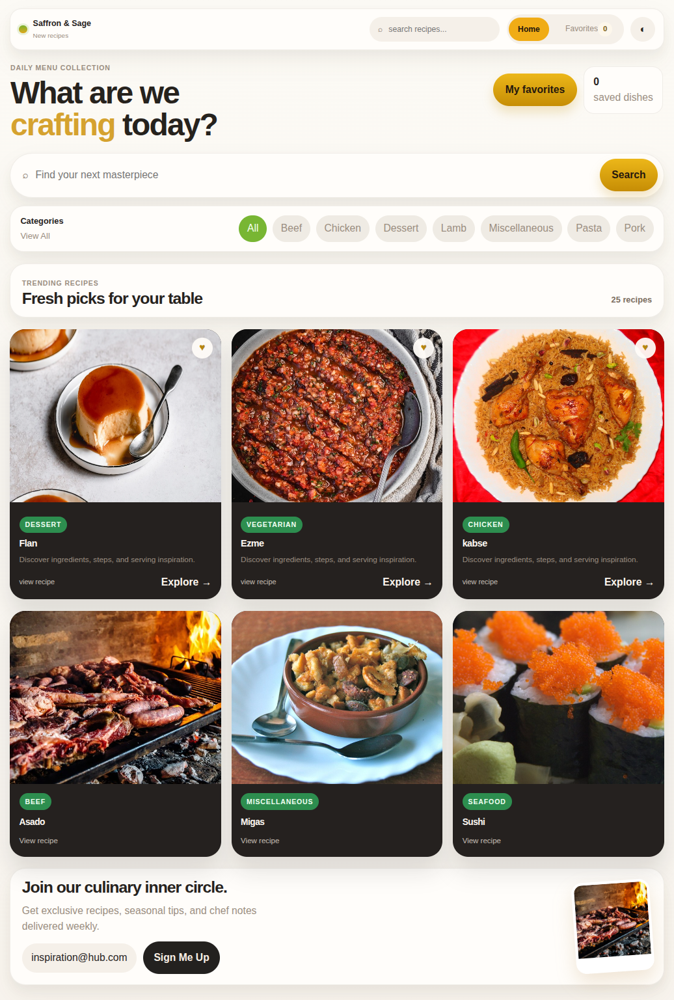

# Recipe Explorer

Recipe Explorer is a React + TypeScript app for discovering meals from TheMealDB, filtering them quickly, and saving favorites locally for later. It focuses on a smooth browsing flow with animated view transitions, responsive cards, and a polished food-inspired UI.

## Features

- Browse recipes in a responsive card grid.
- Search recipes by name with debounced input updates.
- Filter recipes by category without reloading the page.
- Open an animated recipe detail view with ingredients and instructions.
- Add and remove favorites with persistence through `localStorage`.
- Visit a dedicated Favorites page for saved recipes.
- See loading and error states while data is being fetched.
- Toggle between light and dark themes.

## Screenshots



## Project Structure

```text
src/
  components/
    Loader.tsx
    RecipeCard.tsx
    SearchBar.tsx
  pages/
    Favorites.tsx
    Home.tsx
    RecipeDetail.tsx
  services/
    api.ts
  App.tsx
```

## How to Run

1. Install dependencies:

```bash
npm install
```

2. Start the development server:

```bash
npm run dev
```

3. Build for production:

```bash
npm run build
```

4. Preview the production build:

```bash
npm run preview
```

## API

This project uses [TheMealDB](https://www.themealdb.com/api.php) for recipes, categories, and recipe details.
